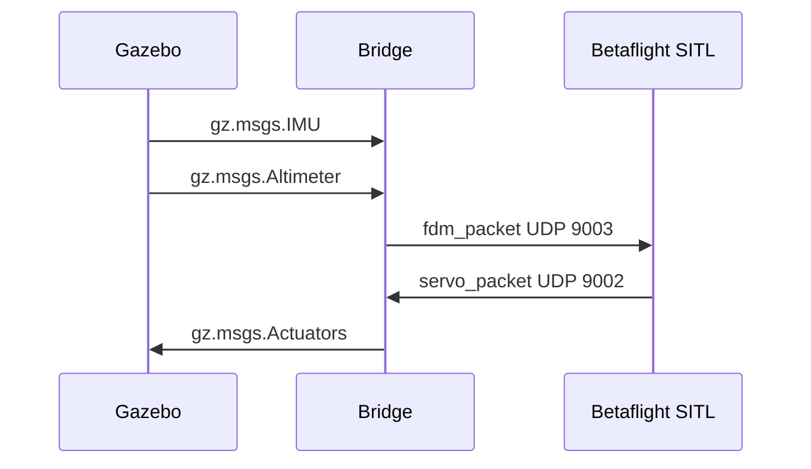
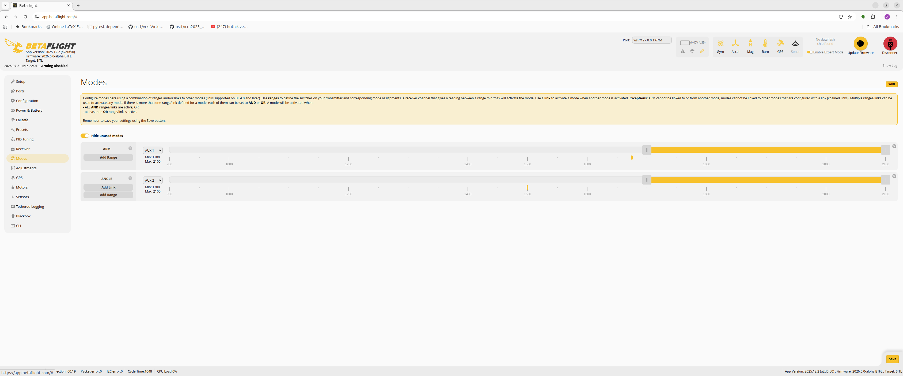

# gz_betaflight_bridge

`gz_betaflight_bridge` connects Betaflight SITL to Gazebo Sim Harmonic. Gazebo provides simulated IMU and altitude feedback, Betaflight computes motor outputs, and the bridge converts those outputs into `gz.msgs.Actuators` commands for Gazebo's multicopter motor model.

## What It Does

- Runs a standalone C++ bridge process between Gazebo and Betaflight SITL.
- Sends Gazebo sensor feedback to Betaflight as FDM packets on UDP `9003`.
- Receives Betaflight motor outputs on UDP `9002`.
- Converts normalized Betaflight motor commands into rotor velocity commands.
- Supports MSP-based Python hover control through Betaflight MSP TCP `5761`.
- Provides VS Code tasks to start Gazebo, SITL, the bridge, and websockify in split terminals.

## Architecture


---

## Requirements

- CMake 3.23 or newer
- Ninja
- C++20 compiler, such as GCC 13
- Gazebo Sim Harmonic development packages
- `yaml-cpp` and `spdlog`
- VS Code with C/C++ and CMake Tools extensions

Ubuntu package baseline:

```bash
sudo apt update
sudo apt install build-essential cmake ninja-build gdb libyaml-cpp-dev libspdlog-dev
```

---

## Build

Configure and build the debug preset:

```bash
cmake --preset debug
cmake --build --preset debug
```

The bridge executable is created at:

```text
build/debug/betaflight_gazebo_bridge
```

Build Betaflight SITL with:

```bash
scripts/builders/build_betaflight_sitl.sh
```

The script lists the three newest stable `X.Y.Z` tags, excluding alpha, beta,
and release-candidate tags. Select a version from the numbered menu. The build
prints timestamped progress messages and installs the selected SITL executable
at `bin/betaflight_SITL.elf`.


### python venv 

```bash
# under root project folder
uv venv

# install
uv pip install websockify
```

### Betaflight configure

- set ARM: aux1 
- set ANGEL: aux2

```
# 

# diff

# version
# Betaflight / SITL (SITL) 2026.6.0-alpha Jul 24 2026 / 16:31:24 (81da7c596) MSP API: 1.48

# start the command batch
batch start


# feature
feature -RX_UDP
feature -TELEMETRY
feature RX_MSP

# aux
aux 0 0 0 1700 2100 0 0
aux 1 1 1 1700 2100 0 0

profile 0

rateprofile 0

battery_profile 0

# end the command batch
batch end

# 
```




---

## Gazebo world and plugin

The simulation world is defined in [worlds/quadcopter.sdf](worlds/quadcopter.sdf). It loads Gazebo's physics, sensor, scene, user-command, IMU, and altimeter systems, then includes the local X3 quadcopter model from [models/betaflight_x3/model.sdf](models/betaflight_x3/model.sdf).

An additive camera-enabled world is available at
[worlds/quadcopter_sensor.sdf](worlds/quadcopter_sensor.sdf). It includes the
`model://betaflight_x3_sensor` wrapper, which keeps the original X3 links and
motor configuration and adds a fixed forward camera. The original world and
launcher remain unchanged.

Run the sensor world directly:

```bash
scripts/worlds/run_quadcopter_sensor_world.sh -r
```

Run the navigation practice world with trees, a house, flight gate, tower,
and five marked points of interest:

```bash
scripts/worlds/run_quadcopter_navigation_world.sh -r
```

The camera publishes 640x480 RGB images at 30 Hz on:

```text
/X3/front_camera/image
```

The sensor world opens a docked `Front Camera` Image Display widget already
bound to that topic.

The wrapper also publishes two single-beam rangefinders at 20 Hz:

```text
/X3/front_range/scan  # forward, aligned with the camera
/X3/down_range/scan   # fixed downward, toward the ground
```

Both topics use `gz.msgs.LaserScan` and contain one value in `ranges`.

Each rotor is connected to Gazebo's `MulticopterMotorModel` system. The bridge publishes rotor velocity commands to:

```text
/X3/gazebo/command/motor_speed
```

The four motor plugins read that `gz.msgs.Actuators` message by actuator index and turn each commanded rotor speed into thrust, drag, and reaction torque. Gazebo physics then moves the X3 body, while the IMU and altimeter sensors publish feedback that the bridge sends back to Betaflight.

For tuning, the important motor-model values are `<maxRotVelocity>`, `<motorConstant>`, `<momentConstant>`, and each rotor's `<turningDirection>`. The bridge's `motors.max_rotor_velocity_rad_s` in [config/bridge.yaml](config/bridge.yaml) should match Gazebo's `<maxRotVelocity>` values.


[read more ](docs/gazebo_world_motor_model.md)

---

## Run The Stack

Then start 
- Gazebo
-  Betaflight SITL,
-  Bridge
-  websockify for msp and use betaflight configure:

```text
Command Palette -> Tasks: Run Task -> Stack: run all
```

The task opens four split terminals in one terminal panel group:

| Task | Starts |
|---|---|
| `Stack: gazebo` | `scripts/worlds/run_quadcopter_world.sh -r` |
| `Stack: gazebo sensor` | `scripts/worlds/run_quadcopter_sensor_world.sh -r` |
| `Stack: sitl` | `scripts/run/run_betaflight_sitl.sh` |
| `Stack: bridge` | `scripts/run/run_bridge.sh config/bridge.yaml` |
| `Stack: websockify` | `uv run websockify 127.0.0.1:6761 127.0.0.1:5761` |


---

## Tip: using tmux and tmuxp to run multiple script

```bash title="install"
sudo apt install tmux tmuxp
```

```yaml title="tmuxp script"
session_name: run_sim
start_directory: ..
windows:
  - window_name: stack
    layout: tiled
    panes:
      - shell_command:
          - printf '\033]2;%s\033\\' 'gazebo'
          - ./scripts/worlds/run_quadcopter_world.sh -r
      - shell_command:
          - printf '\033]2;%s\033\\' 'websockify'
          - uv run websockify 127.0.0.1:6761 127.0.0.1:5761
      - shell_command:
          - printf '\033]2;%s\033\\' 'sitl'
          - ./scripts/run/run_betaflight_sitl.sh
      - shell_command:
          - printf '\033]2;%s\033\\' 'bridge'
          - ./scripts/run/run_bridge.sh config/bridge.yaml

```

```bash title="tmux run script"
tmuxp load config/run_sim.yaml
```

> [!TIP]
> - Copy config/.tmux.conf to home folder  
> - ctrl-a ctrl-c exit tmux session  
> - using mouse to switch pane focus  


> [!TIP]
> Clear gazebo process  
> ```
> pkill -9 -f "gz sim"  
> ```

 
---

## Motor test

```text
Command Palette -> Tasks: Run Task -> Stack: run all
```


[](docs/images/motor_order_check.mp4)

[Open the MP4 recording](docs/images/motor_order_check.mp4)

---

## Diagnostic tools

Inspect the running Betaflight SITL build and configuration:

```bash
python3 scripts/tools/inspect_sitl_msp.py
```

Check virtual GPS data:

```bash
python3 scripts/tools/check_gps_msp.py
```

See [docs/sitl_tools.md](docs/sitl_tools.md) for all retained tools.

### Usage menu

| Topic | Start here |
|---|---|
| Full documentation index | [docs/index.md](docs/index.md) |
| Bridge architecture and runtime flow | [docs/bridge_architecture.md](docs/bridge_architecture.md) |
| YAML config, ports, topics, and motor map | [docs/configuration.md](docs/configuration.md) |
| SITL diagnostic tools | [docs/sitl_tools.md](docs/sitl_tools.md) |
| Gazebo motor and thrust tuning | [docs/gazebo_world_motor_model.md](docs/gazebo_world_motor_model.md) |
| Project summary presentation | [docs/project_summary_presentation.md](docs/project_summary_presentation.md) |

---

## Gazebo 

Gazebo's `MulticopterMotorModel` plugin turns rotor speed commands into simulated forces. The bridge publishes `gz.msgs.Actuators` with one rotor velocity per motor, and each motor plugin applies thrust, drag, and yaw torque to the X3 quadcopter model.

The important idea is that Betaflight does not directly move the drone in Gazebo. Betaflight outputs normalized motor values, the bridge converts them to rad/s, and Gazebo uses the motor model parameters to calculate lift:

```text
thrust_N = motorConstant * rotor_speed_rad_s^2
```

For stable tuning, keep the bridge `max_rotor_velocity_rad_s` and each Gazebo `<maxRotVelocity>` value matched. Increase those values, or increase `motorConstant`, when the drone needs too much throttle to lift.

[more](docs/gazebo_world_motor_model.md)


gz topic -t /X3/gazebo/command/motor_speed --msgtype gz.msgs.Actuators -p 'velocity:[100, 0, 0, 0]'
