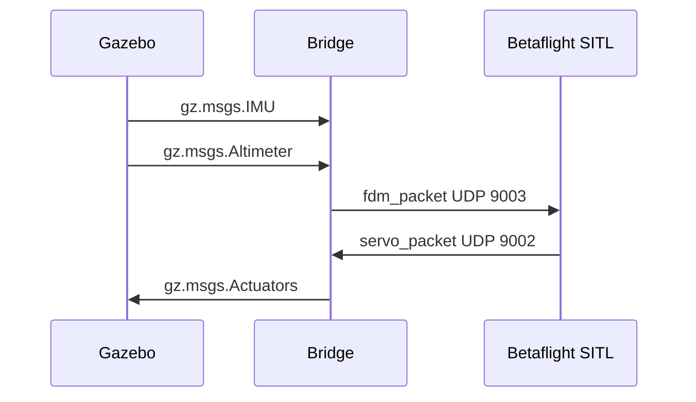

# gz_betaflight_bridge

`gz_betaflight_bridge` connects Betaflight SITL to Gazebo Sim Harmonic. Gazebo provides simulated IMU and altitude feedback, Betaflight computes motor outputs, and the bridge converts those outputs into `gz.msgs.Actuators` commands for Gazebo's multicopter motor model.

## What It Does

- Runs a standalone C++ bridge process between Gazebo and Betaflight SITL.
- Sends Gazebo sensor feedback to Betaflight as FDM packets on UDP `9003`.
- Receives Betaflight motor outputs on UDP `9002`.
- Converts normalized Betaflight motor commands into rotor velocity commands.
- Supports MSP-based Python hover control through Betaflight MSP TCP `5761`.
- Provides VS Code tasks to start Gazebo, SITL, the bridge, and websockify in split terminals.

## Architecture


---

## Requirements

- CMake 3.23 or newer
- Ninja
- C++20 compiler, such as GCC 13
- Gazebo Sim Harmonic development packages
- `yaml-cpp` and `spdlog`
- VS Code with C/C++ and CMake Tools extensions

Ubuntu package baseline:

```bash
sudo apt update
sudo apt install build-essential cmake ninja-build gdb libyaml-cpp-dev libspdlog-dev
```

---

## Build

Configure and build the debug preset:

```bash
cmake --preset debug
cmake --build --preset debug
```

The bridge executable is created at:

```text
build/debug/betaflight_gazebo_bridge
```

---

## Run The Stack

Then start 
- Gazebo
-  Betaflight SITL,
-  Bridge
-  websockify for msp and use betaflight configure:

```text
Command Palette -> Tasks: Run Task -> Stack: run all
```

The task opens four split terminals in one terminal panel group:

| Task | Starts |
|---|---|
| `Stack: gazebo` | `scripts/run_quadcopter_world.sh -r` |
| `Stack: sitl` | `scripts/run_betaflight_sitl.sh` |
| `Stack: bridge` | `scripts/run_bridge.sh config/bridge.yaml` |
| `Stack: websockify` | `uv run websockify 127.0.0.1:6761 127.0.0.1:5761` |


---

## Usage 
### Demo: Msp Hover control
After the bridge is running and receiving Gazebo sensor data, run the MSP hover controller in another terminal:

```bash
scripts/hover_msp_controller.py \
  --target-altitude 5 \
  --duration 45 \
  --hover-throttle 1750 \
  --kp 120 \
  --ki 15 \
  --kd 60
```

### Other usage
- [Full msp hover document ](docs/usage/msp_hover_python.md)
- [joystick msp control](docs/usage/joystick_rc_msp.md)

---

### Usage Menu

| Topic | Start here |
|---|---|
| Direct Python MSP hover, PID tuning, and descent | [docs/usage/msp_hover_python.md](docs/usage/msp_hover_python.md) |
| MSP joystick RC control and JSON mapping | [docs/usage/joystick_rc_msp.md](docs/usage/joystick_rc_msp.md) |
| Full documentation index | [docs/index.md](docs/index.md) |
| Bridge architecture and runtime flow | [docs/bridge_architecture.md](docs/bridge_architecture.md) |
| YAML config, ports, topics, and motor map | [docs/configuration.md](docs/configuration.md) |
| Betaflight EEPROM setup for MSP RC | [docs/betaflight_sitl_eeprom.md](docs/betaflight_sitl_eeprom.md) |
| Gazebo motor and thrust tuning | [docs/gazebo_world_motor_model.md](docs/gazebo_world_motor_model.md) |
| MSP square mission | [docs/msp_square_mission.md](docs/msp_square_mission.md) |
| Project summary presentation | [docs/project_summary_presentation.md](docs/project_summary_presentation.md) |

