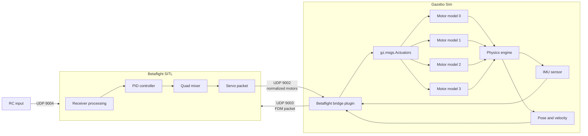
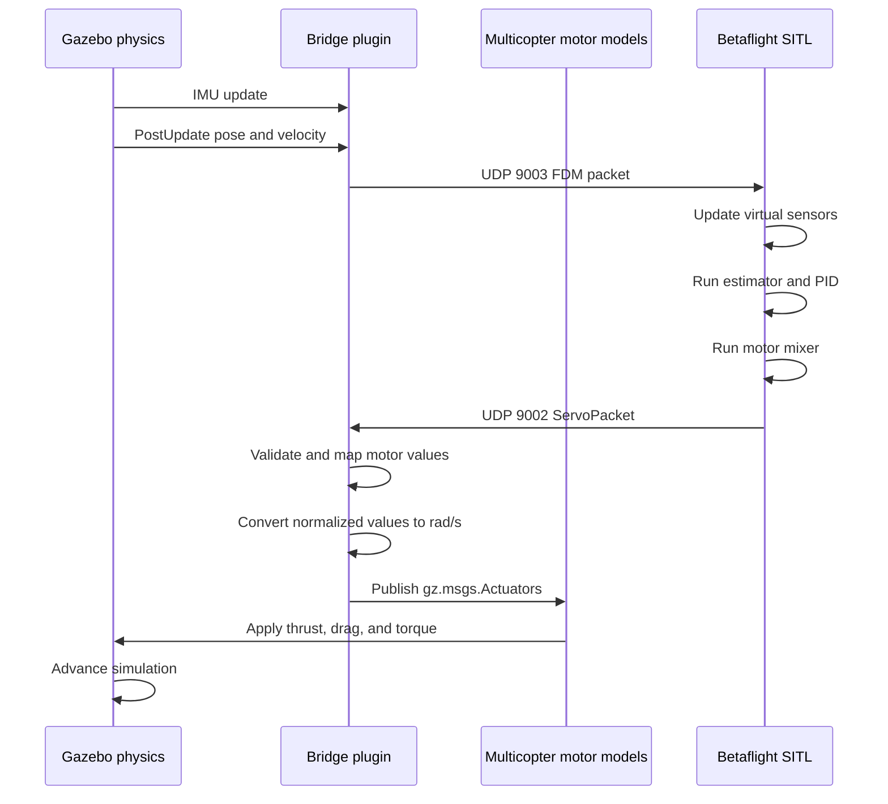

# Betaflight SITL ↔ Gazebo Sim Bridge

## Codex Implementation Plan and Milestones

## 1. Project goal

Implement a Gazebo Sim system plugin that connects Betaflight SITL to the standard Gazebo multicopter motor model.

The bridge must:

- Receive normalized motor outputs from Betaflight SITL over UDP.
- Convert normalized motor commands to rotor angular velocity in radians per second.
- Publish `gz.msgs.Actuators` messages consumed by `gz-sim-multicopter-motor-model-system`.
- Read IMU data from a Gazebo IMU sensor.
- Read altitude, position, and velocity from the Gazebo model state.
- Send a Betaflight-compatible FDM packet back to SITL over UDP.
- Stop motors safely when Betaflight stops sending commands.
- Support configurable motor mapping, ports, topics, and maximum rotor speed.

## 2. Target architecture



## 3. Design principles

1. The bridge must not calculate thrust directly.
2. The existing Gazebo `MulticopterMotorModel` remains responsible for thrust, reaction torque, drag, and rotor dynamics.
3. The bridge only performs protocol conversion, coordinate conversion, state collection, timing, and safety handling.
4. All model-specific settings must be configurable through SDF.
5. UDP receive operations must be non-blocking.
6. Gazebo simulation callbacks must never wait for network traffic.
7. The implementation must initially target one quadcopter and later allow multiple SITL instances through configurable ports and namespaces.

## 4. Initial scope

### Included

- Four motors.
- Betaflight UDP motor output on port `9002`.
- Betaflight FDM input on port `9003`.
- Optional RC input remains external on port `9004`.
- Gazebo Harmonic or the installed compatible Gazebo Sim version.
- Linux x86-64.
- Raw Betaflight SITL packet structures.
- IMU angular velocity.
- IMU linear acceleration.
- IMU quaternion orientation.
- World position.
- World linear velocity.
- Altitude from model world Z position.
- Configurable motor map.
- Motor command timeout.

### Not included in the first version

- Battery voltage sag.
- Motor electrical model.
- ESC or DShot simulation.
- GPS latitude/longitude conversion.
- Sensor delay and packet loss.
- Multiple vehicles.
- Windows support.
- Network byte-order serialization.
- Rotor failure simulation.

## 5. Proposed repository structure

```text
betaflight_gazebo_bridge/
├── CMakeLists.txt
├── README.md
├── LICENSE
├── include/
│   └── betaflight_gazebo_bridge/
│       ├── BetaflightBridge.hh
│       ├── Packets.hh
│       ├── UdpSocket.hh
│       ├── MotorMapper.hh
│       └── FrameConversions.hh
├── src/
│   ├── BetaflightBridge.cc
│   ├── UdpSocket.cc
│   ├── MotorMapper.cc
│   └── FrameConversions.cc
├── test/
│   ├── test_packets.cc
│   ├── test_motor_mapper.cc
│   ├── test_frame_conversions.cc
│   └── test_udp_loopback.cc
├── models/
│   └── betaflight_x3/
│       ├── model.config
│       └── model.sdf
├── worlds/
│   └── betaflight_quadcopter.sdf
├── scripts/
│   ├── send_test_motors.py
│   ├── receive_fdm.py
│   └── run_demo.sh
└── docs/
    ├── packet_protocol.md
    ├── coordinate_frames.md
    └── troubleshooting.md
```

## 6. Packet definitions

Create packet definitions that exactly match the Betaflight SITL implementation.

```cpp
#pragma once

#include <cstddef>
#include <type_traits>

namespace betaflight_gazebo_bridge
{

struct ServoPacket
{
    float motorSpeed[4];
};

struct FdmPacket
{
    double timestamp;

    double imuAngularVelocityRpy[3];
    double imuLinearAccelerationXyz[3];
    double imuOrientationQuat[4];

    double velocityXyz[3];
    double positionXyz[3];

    double pressure;
};

static_assert(std::is_standard_layout_v<ServoPacket>);
static_assert(std::is_trivially_copyable_v<ServoPacket>);
static_assert(sizeof(ServoPacket) == 16);

static_assert(std::is_standard_layout_v<FdmPacket>);
static_assert(std::is_trivially_copyable_v<FdmPacket>);
static_assert(sizeof(FdmPacket) == 18 * sizeof(double));

}  // namespace betaflight_gazebo_bridge
```

Codex must verify the current Betaflight source before finalizing field names, field order, and packet size.

## 7. SDF plugin configuration

The bridge plugin should support this configuration:

```xml
<plugin
  filename="libBetaflightGazeboBridge.so"
  name="betaflight_gazebo_bridge::BetaflightBridge">

  <sitlAddress>127.0.0.1</sitlAddress>

  <motorPort>9002</motorPort>
  <fdmPort>9003</fdmPort>

  <motorTopic>/X3/gazebo/command/motor_speed</motorTopic>
  <imuTopic>/world/quadcopter/model/X3/link/base_link/sensor/imu/imu</imuTopic>

  <maxRotorVelocity>800.0</maxRotorVelocity>
  <minimumRotorVelocity>0.0</minimumRotorVelocity>

  <motorMap>0 1 2 3</motorMap>

  <fdmRateHz>500</fdmRateHz>
  <motorTimeoutSeconds>0.10</motorTimeoutSeconds>

  <enablePressureFromAltitude>true</enablePressureFromAltitude>
  <seaLevelPressurePa>101325.0</seaLevelPressurePa>
</plugin>
```

## 8. Runtime sequence



## 9. Motor command conversion

Start with a linear conversion:

```text
rotorVelocity = clamp(normalizedMotor, 0, 1) × maxRotorVelocity
```

Example for `maxRotorVelocity = 800 rad/s`:

| Betaflight command | Gazebo rotor command |
|---:|---:|
| 0.00 | 0 rad/s |
| 0.25 | 200 rad/s |
| 0.50 | 400 rad/s |
| 0.75 | 600 rad/s |
| 1.00 | 800 rad/s |

The first implementation must not add throttle curves. A configurable nonlinear curve may be introduced only after the linear bridge works and is tested.

## 10. Motor mapping

The bridge must allow Gazebo rotor order to differ from Betaflight motor order.

Example:

```xml
<motorMap>1 0 3 2</motorMap>
```

Interpretation:

```text
Gazebo actuator 0 receives Betaflight motor 1
Gazebo actuator 1 receives Betaflight motor 0
Gazebo actuator 2 receives Betaflight motor 3
Gazebo actuator 3 receives Betaflight motor 2
```

Validation rules:

- Exactly four indices must be supplied.
- Every index must be in the range `0..3`.
- Duplicate indices must be rejected.
- Invalid configuration must produce a clear Gazebo error and prevent plugin initialization.

## 11. Sensor mapping

### IMU

Read from `gz.msgs.IMU`:

- Angular velocity X, Y, Z.
- Linear acceleration X, Y, Z.
- Quaternion W, X, Y, Z.

### Altitude

Initially use:

```text
altitude = worldPose.position.z
```

Set:

```text
position_xyz[2] = altitude
```

### Position and velocity

Initially copy Gazebo world values:

```text
position_xyz = [worldX, worldY, worldZ]
velocity_xyz = [worldVx, worldVy, worldVz]
```

GPS-compatible latitude and longitude conversion is deferred to a later milestone.

### Pressure

Initially support two modes:

1. Send pressure as zero and let the Betaflight Gazebo-specific SITL path derive pressure from altitude.
2. Compute pressure from altitude in the bridge when enabled.

Use the standard atmosphere approximation:

```text
pressure = seaLevelPressure × (1 - 2.25577e-5 × altitude)^5.25588
```

The bridge must clamp invalid altitude inputs so the pressure calculation never produces NaN.

## 12. Coordinate-frame strategy

Coordinate conversion is a high-risk area and must be isolated in `FrameConversions`.

Expected Gazebo conventions commonly include:

```text
World ENU:
X = East
Y = North
Z = Up

Body FLU:
X = Forward
Y = Left
Z = Up
```

Betaflight sensor conventions may differ, and the current SITL implementation may already apply Gazebo-specific sign corrections.

Implementation rules:

1. Do not scatter axis negations throughout the plugin.
2. Implement all sign and quaternion conversions in named functions.
3. Document each conversion with source and destination frames.
4. Verify the current Betaflight simulator code before deciding which conversions belong in Gazebo and which are already performed inside Betaflight.
5. Add unit tests for identity, 90-degree roll, 90-degree pitch, and 90-degree yaw.

Suggested interface:

```cpp
class FrameConversions
{
public:
    static gz::math::Vector3d ImuAngularVelocityToBetaflight(
        const gz::math::Vector3d &value);

    static gz::math::Vector3d ImuLinearAccelerationToBetaflight(
        const gz::math::Vector3d &value);

    static gz::math::Quaterniond OrientationToBetaflight(
        const gz::math::Quaterniond &value);

    static gz::math::Vector3d WorldVelocityToBetaflight(
        const gz::math::Vector3d &value);
};
```

## 13. Timing requirements

Default targets:

```text
Gazebo physics rate: 1000 Hz
FDM packet rate: 500 Hz
Motor receive: non-blocking every PreUpdate
Motor publish: every PreUpdate
```

Requirements:

- Use simulation time in the FDM timestamp.
- Do not use wall-clock time for packet timestamps.
- Wall-clock time may be used only for detecting a stalled Betaflight process when the simulation remains running.
- Do not send FDM packets while Gazebo is paused.
- Drain all queued motor packets and keep only the newest complete packet.
- Ignore malformed packets without crashing.

## 14. Safety requirements

The bridge must implement the following safeguards:

- Clamp normalized motor values to `[0, 1]`.
- Reject NaN and infinity.
- Set all motor commands to zero after the configured timeout.
- Set all motors to zero when the plugin is destroyed.
- Do not publish uninitialized motor values.
- Do not send FDM packets until valid IMU and model state are available.
- Log malformed UDP packet sizes with rate limiting.
- Prevent exceptions from escaping Gazebo update callbacks.

## 15. Milestones

## Milestone 0 — Source verification and project bootstrap

### Tasks

- Inspect the current Betaflight simulator implementation.
- Confirm UDP ports and packet structures.
- Confirm any compile-time flags required for the Gazebo path.
- Inspect the current `quadcopter.sdf` example.
- Confirm Gazebo package names and CMake targets for the installed Gazebo version.
- Create the repository structure.
- Add CMake configuration.
- Add formatting and compiler-warning settings.

### Deliverables

- Buildable empty Gazebo system plugin.
- `Packets.hh` with verified packet layouts.
- `docs/packet_protocol.md`.
- `README.md` containing build instructions.

### Acceptance criteria

- `cmake` configures successfully.
- The shared library builds.
- Gazebo loads the plugin without symbol errors.
- Packet size tests pass.

---

## Milestone 1 — UDP transport layer

### Tasks

- Implement an RAII UDP socket wrapper.
- Add non-blocking receive support.
- Add destination configuration and send support.
- Detect truncated and oversized packets.
- Add loopback tests.
- Add a Python script that sends synthetic motor packets.
- Add a Python script that receives and prints FDM packets.

### Deliverables

- `UdpSocket.hh` and `UdpSocket.cc`.
- `test_udp_loopback.cc`.
- `scripts/send_test_motors.py`.
- `scripts/receive_fdm.py`.

### Acceptance criteria

- A test motor packet can be sent from Python and received by C++.
- A test FDM packet can be sent from C++ and decoded by Python.
- Receive operations never block the Gazebo update thread.
- Invalid packet sizes are rejected safely.

---

## Milestone 2 — Gazebo actuator publication

### Tasks

- Parse motor topic, maximum rotor velocity, timeout, and motor map from SDF.
- Receive `ServoPacket` values from UDP port `9002`.
- Validate values.
- Map Betaflight motor order to Gazebo actuator order.
- Convert normalized values to radians per second.
- Publish `gz.msgs.Actuators`.
- Implement motor timeout failsafe.

### Deliverables

- `MotorMapper.hh` and `MotorMapper.cc`.
- Motor receive and actuator publish path in the plugin.
- Unit tests for mapping, clamping, NaN handling, and timeout behavior.

### Acceptance criteria

- Synthetic commands rotate the expected Gazebo rotors.
- `1.0` produces the configured maximum rotor velocity.
- Motor order can be changed through SDF.
- Motors stop after the timeout when packets stop.
- The bridge does not calculate or apply thrust itself.

---

## Milestone 3 — IMU and model state collection

### Tasks

- Subscribe to the Gazebo IMU topic.
- Store the newest IMU sample thread-safely.
- Enable or access world pose and world linear velocity components.
- Read altitude from world Z.
- Add state validity checks.
- Add diagnostic logging for missing topics or components.

### Deliverables

- IMU callback.
- Model pose and velocity reading.
- Internal state snapshot structure.

### Acceptance criteria

- The plugin reports valid angular velocity, acceleration, and quaternion data.
- Altitude follows the model Z position.
- Velocity follows Gazebo model motion.
- The plugin does not send uninitialized sensor data.

---

## Milestone 4 — Betaflight FDM output

### Tasks

- Construct an `FdmPacket` from the latest Gazebo state.
- Use Gazebo simulation time as the timestamp.
- Send the packet to port `9003` at a configurable rate.
- Add optional pressure calculation from altitude.
- Add packet logging in debug mode.
- Verify that Betaflight acknowledges the FDM stream by producing motor packets.

### Deliverables

- Complete Gazebo-to-Betaflight UDP path.
- Configurable FDM rate.
- FDM receiver test script.

### Acceptance criteria

- Betaflight receives valid FDM packets.
- Betaflight begins sending motor packets.
- The bridge publishes those motor packets as Gazebo actuator commands.
- The closed communication loop runs continuously for at least five minutes without deadlock or crash.

---

## Milestone 5 — Coordinate-frame validation

### Tasks

- Compare Gazebo IMU conventions with the current Betaflight simulator conversion logic.
- Implement conversions only where necessary.
- Add explicit conversion functions.
- Create deterministic orientation tests.
- Verify roll, pitch, and yaw directions in Betaflight.
- Verify accelerometer sign while stationary and during vertical acceleration.

### Manual tests

1. Rotate the model positive roll.
2. Confirm Betaflight reports the expected roll direction.
3. Rotate the model positive pitch.
4. Confirm Betaflight reports the expected pitch direction.
5. Rotate clockwise when viewed from above.
6. Confirm Betaflight yaw direction.
7. Move the model upward.
8. Confirm altitude increases.
9. Accelerate upward.
10. Confirm accelerometer response is physically consistent.

### Acceptance criteria

- Roll, pitch, and yaw signs are correct.
- Quaternion order is correct.
- The vehicle is level in Gazebo and level in Betaflight at startup.
- No duplicate ENU/NED or FLU/FRD transformation is applied.
- Unit tests document the final frame convention.

---

## Milestone 6 — Closed-loop flight

### Tasks

- Connect RC input to Betaflight SITL.
- Arm Betaflight.
- Verify idle motor behavior.
- Tune maximum rotor velocity and motor constants sufficiently for lift-off.
- Perform manual hover tests.
- Check roll, pitch, and yaw response.
- Record motor commands, IMU, altitude, and real-time factor.

### Acceptance criteria

- The quadcopter arms.
- Motors spin in the correct order and direction.
- The quadcopter lifts off.
- Roll, pitch, and yaw commands act in the expected direction.
- The vehicle can maintain a controlled hover for at least ten seconds.
- Motor timeout safely stops the vehicle after SITL termination.

---

## Milestone 7 — Documentation and reproducibility

### Tasks

- Complete build and run documentation.
- Document required Betaflight build flags.
- Document Betaflight configuration commands.
- Document motor-order validation.
- Document coordinate-frame decisions.
- Document troubleshooting steps.
- Add a single command or script for launching the demo.

### Deliverables

- Complete `README.md`.
- `docs/coordinate_frames.md`.
- `docs/troubleshooting.md`.
- `scripts/run_demo.sh`.
- Example world and model files.

### Acceptance criteria

- A clean Ubuntu environment can build and run the demo using only the documented commands.
- No undocumented manual source changes are required.
- All tests pass.

## 16. Optional later milestones

## Milestone 8 — GPS and geographic coordinates

- Convert Gazebo local ENU coordinates to latitude, longitude, and altitude.
- Use Gazebo spherical coordinates when available.
- Validate East, North, and Up velocity conventions.
- Support Betaflight virtual GPS.

## Milestone 9 — Multiple vehicles

- Add configurable motor and FDM ports per model.
- Add configurable topic namespace.
- Run multiple Betaflight SITL processes.
- Verify network and topic isolation.

## Milestone 10 — Sensor realism

- Add configurable IMU noise.
- Add barometer noise.
- Add sensor delays.
- Add packet delay, jitter, and loss.
- Add bias and drift.

## Milestone 11 — Battery and propulsion realism

- Add battery voltage state.
- Map battery voltage and motor KV to attainable rotor speed.
- Add voltage sag under load.
- Add motor and ESC response limits.
- Support separate 3S and 6S propulsion configurations.

## 17. Testing strategy

### Unit tests

Test without running Gazebo:

- Packet sizes and layouts.
- Motor mapping.
- Motor clamping.
- NaN and infinity rejection.
- Pressure calculation.
- Coordinate conversions.
- Timeout state transitions.

### Integration tests

Run with Gazebo but without Betaflight:

- Send synthetic motor packets.
- Verify actuator topic contents.
- Verify rotor joint movement.
- Verify motor timeout.
- Verify FDM packet output.

### System tests

Run Gazebo and Betaflight:

- FDM packet starts the Betaflight control loop.
- Betaflight motor packets reach Gazebo.
- Arm and disarm behavior.
- Roll, pitch, yaw, and throttle tests.
- Hover test.
- SITL process termination test.

## 18. Logging requirements

Use clear log categories:

```text
[BetaflightBridge][Config]
[BetaflightBridge][UDP]
[BetaflightBridge][Motor]
[BetaflightBridge][IMU]
[BetaflightBridge][FDM]
[BetaflightBridge][Frames]
[BetaflightBridge][Failsafe]
```

Normal runtime must not print every packet.

Recommended logging behavior:

- Configuration summary once at startup.
- First valid motor packet once.
- First valid IMU packet once.
- First FDM packet once.
- Timeout entry and recovery.
- Invalid packet sizes with rate limiting.
- Debug packet values only when explicitly enabled.

## 19. Definition of done

The first production-ready version is complete when:

- The plugin builds against the target Gazebo version.
- Betaflight SITL receives Gazebo IMU and altitude data.
- Betaflight SITL sends four normalized motor commands.
- The bridge publishes four rotor velocities through `gz.msgs.Actuators`.
- The standard Gazebo multicopter motor plugins create vehicle thrust and torque.
- Motor order and frame signs are verified.
- The quadcopter can arm, lift off, and perform a controlled hover.
- Motor timeout stops all motors safely.
- Unit and integration tests pass.
- Build, configuration, and run instructions are documented.

## 20. Codex working rules

Codex should follow these rules while implementing:

1. Inspect existing project files before editing.
2. Verify current Gazebo and Betaflight APIs instead of assuming old API names.
3. Make small commits or logically separated patches.
4. Build after each milestone.
5. Add tests with each new isolated component.
6. Do not combine coordinate conversion with UDP or motor-mapping logic.
7. Do not add battery or GPS functionality before the base closed loop works.
8. Preserve the standard `MulticopterMotorModel` as the only thrust-producing component.
9. Treat compiler warnings as errors for project code where practical.
10. Document every non-obvious sign inversion.
11. Do not block inside Gazebo callbacks.
12. Keep the most recent UDP motor packet and discard stale queued packets.

## 21. Suggested Codex prompts

### Prompt 1 — Bootstrap

```text
Create a C++ Gazebo Sim system plugin project named betaflight_gazebo_bridge.
Target the Gazebo version installed in this environment. Add CMake configuration,
an empty BetaflightBridge plugin, packet structure definitions, and unit tests for
packet sizes. Inspect the current Betaflight simulator source before finalizing the
packet layouts. Do not implement UDP or motor control yet. Build the project and
report any version-specific API choices.
```

### Prompt 2 — UDP layer

```text
Implement a non-blocking RAII UDP socket wrapper for the bridge project. Add receive,
send, bind, destination configuration, packet-size validation, and loopback tests.
The Gazebo update thread must never block. Also add small Python scripts for sending
a four-float motor packet and receiving the FDM packet. Do not modify Gazebo control
logic yet.
```

### Prompt 3 — Motor bridge

```text
Implement the Betaflight motor-input path. Receive the verified ServoPacket on UDP
port 9002, validate values, apply a configurable four-element motor map, convert
normalized values to rad/s using maxRotorVelocity, and publish gz.msgs.Actuators.
Add a configurable motor timeout that publishes zero to all motors. Add unit tests
for mapping, clamping, invalid floating-point values, and timeout behavior. Do not
apply thrust directly.
```

### Prompt 4 — Sensor and FDM path

```text
Implement Gazebo IMU subscription and model state collection. Build the verified
Betaflight FdmPacket using simulation time, IMU angular velocity, linear acceleration,
quaternion orientation, world velocity, world position, and altitude. Send it to UDP
port 9003 at a configurable rate. Do not introduce coordinate sign changes outside
a dedicated FrameConversions module.
```

### Prompt 5 — Frame validation

```text
Inspect the current Betaflight SITL Gazebo-specific frame handling and compare it with
Gazebo IMU and world-frame conventions. Implement only the conversions that are truly
required in FrameConversions. Add tests for level orientation and positive 90-degree
roll, pitch, and yaw. Document every sign and quaternion-order decision. Avoid double
converting ENU/NED or FLU/FRD.
```

### Prompt 6 — Demo world

```text
Create an example Gazebo world and model by adapting the standard quadcopter example.
Keep the four gz-sim-multicopter-motor-model-system plugins. Add the new Betaflight
bridge plugin, an IMU sensor, configurable topics, and ports. Add a launch script and
commands for starting Gazebo and Betaflight SITL. Include a procedure to validate one
motor at a time before attempting flight.
```

### Prompt 7 — Closed-loop validation

```text
Run the complete Betaflight SITL and Gazebo bridge. Verify that FDM packets cause
Betaflight to produce motor packets and that the motor packets drive the standard
Gazebo multicopter motor model. Test arm, disarm, throttle, roll, pitch, yaw, and motor
timeout. Fix only issues required for a stable controlled hover. Record the final
motor map and coordinate-frame convention in the documentation.
```

## 22. Final validation checklist

- [ ] Gazebo loads the bridge plugin.
- [ ] Packet sizes match Betaflight.
- [ ] UDP motor receive is non-blocking.
- [ ] UDP FDM send uses simulation time.
- [ ] IMU topic is found.
- [ ] Pose and velocity components are available.
- [ ] Motor values are clamped.
- [ ] NaN and infinity are rejected.
- [ ] Motor mapping is configurable.
- [ ] `gz.msgs.Actuators` contains four velocities.
- [ ] Each motor model reads the correct actuator index.
- [ ] Motor timeout sets all motors to zero.
- [ ] Roll sign is correct.
- [ ] Pitch sign is correct.
- [ ] Yaw sign is correct.
- [ ] Quaternion order is correct.
- [ ] Altitude increases upward.
- [ ] Betaflight receives FDM packets.
- [ ] Betaflight sends motor packets.
- [ ] Vehicle arms and disarms.
- [ ] Vehicle lifts off.
- [ ] Vehicle can hover for ten seconds.
- [ ] Documentation reproduces the result.
