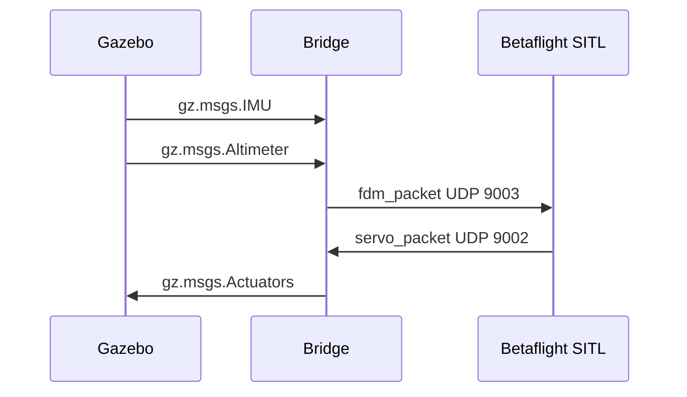

# Bridge architecture

The bridge is a standalone C++ process between Gazebo Harmonic transport topics and Betaflight SITL UDP sockets.

```mermaid
flowchart LR
    GZ_IMU[Gazebo IMU /imu] --> BRIDGE[betaflight_gazebo_bridge]
    GZ_ALT[Gazebo Altimeter /altimeter] --> BRIDGE
    BRIDGE -->|FDM UDP 9003| BF[Betaflight SITL]
    BF -->|Motors UDP 9002| BRIDGE
    BRIDGE -->|gz.msgs.Actuators| MOTORS[/X3/gazebo/command/motor_speed]
    RC[send_rc_test.py] -->|RC UDP 9004| BF
```

## Runtime flow



## Design

The code is split by responsibility:

- `ConfigLoader`: YAML load and validation.
- `UdpSocket`: RAII non-blocking UDP wrapper.
- `GazeboStateSubscriber`: IMU and altimeter subscriptions.
- `FdmBuilder`: Gazebo sensor snapshot to Betaflight FDM packet.
- `MotorMapper`: Betaflight motor order to Gazebo actuator order.
- `MotorVelocityConverter`: normalized motor command to rad/s.
- `ActuatorPublisher`: Gazebo actuator publication.
- `BridgeApp`: process lifecycle, status logging, timing, and shutdown.

The bridge does not calculate thrust. Gazebo's `MulticopterMotorModel` remains responsible for thrust, drag, torque, and rotor dynamics.

