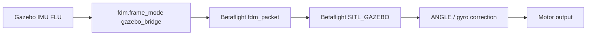

# Coordinate frames

The bridge subscribes to Gazebo IMU data from the X3 model. The model body frame is treated as FLU:

```text
X forward
Y left
Z up
```

Betaflight's `SITL_GAZEBO` target expects the Gazebo bridge packet convention, not a raw Gazebo IMU pass-through. The target assumes the packet was produced by a Gazebo bridge where the IMU sensor frame is effectively FRD:

```text
X forward
Y right
Z down
```

The bridge therefore uses this default conversion:

```yaml
fdm:
  frame_mode: gazebo_bridge
```

Conversion:

```text
angular_velocity:  [x, y, z] -> [x, -y, -z]
linear_accel:      [x, y, z] -> [x, -y, -z]
quaternion wxyz:   [w, x, y, z] -> [w, x, -y, -z]
```

Why this matters:



If the frame conversion is wrong, Betaflight sees roll, pitch, or yaw with the wrong sign. The controller then commands the wrong motor correction, which can look like fast oscillation, a tip-over, or a full flip immediately after takeoff.

For debugging only:

```yaml
fdm:
  frame_mode: passthrough
```

Use `passthrough` only when testing a different Betaflight target or a different simulator packet convention.
