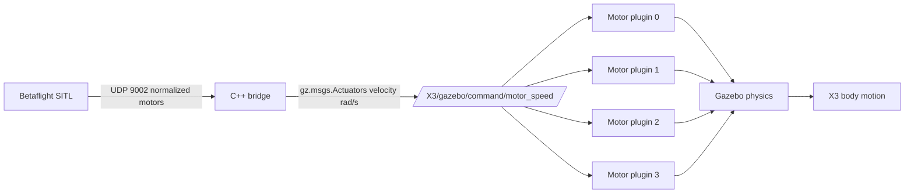

# Gazebo world and MulticopterMotorModel

This project runs a Gazebo Harmonic world from:

```text
worlds/quadcopter.sdf
```

The world includes the local model:

```text
models/betaflight_x3/model.sdf
```

The optional sensor-enabled composition is split into:

```text
models/betaflight_x3_sensor/model.sdf
worlds/quadcopter_sensor.sdf
```

The sensor model merges the original X3 model, owns the same four motor
plugins, and adds a fixed forward camera on `/X3/front_camera/image`. The
original `worlds/quadcopter.sdf` remains available without the camera wrapper.
The sensor world's GUI opens a docked `Front Camera` Image Display widget for
that topic automatically.

Two one-beam GPU lidar sensors are included in the wrapper. The forward sensor
is aligned with the camera and publishes `/X3/front_range/scan`; the fixed
downward sensor publishes `/X3/down_range/scan`. Both publish one
`gz.msgs.LaserScan.ranges` value at 20 Hz.

The bridge does not calculate thrust. Its job is only:

```text
Betaflight motor output -> bridge -> Gazebo Actuators velocity command
```

Gazebo's `MulticopterMotorModel` owns the physics part:

```text
rotor velocity command -> rotor thrust -> reaction torque -> body motion
```

## Runtime flow



The bridge publishes to:

```text
/X3/gazebo/command/motor_speed
```

Each motor plugin reads the same topic, but selects one value using:

```xml
<actuator_number>0</actuator_number>
```

For motor 0, it reads `velocity[0]`. For motor 1, it reads `velocity[1]`, and so on.

## World systems

The world loads these Gazebo systems:

| System | Purpose |
|---|---|
| `Physics` | Integrates forces, torques, collisions, and motion |
| `Sensors` | Runs rendering-backed sensors |
| `SceneBroadcaster` | Lets the GUI display the world |
| `UserCommands` | Enables GUI insert/delete/control commands |
| `Imu` | Publishes the X3 IMU sensor |
| `Altimeter` | Publishes the X3 altimeter sensor |
| `PosePublisher` | Publishes model pose for mission scripts |
| `MulticopterMotorModel` | Converts rotor velocity into thrust and torque |

The physics step is:

```xml
<max_step_size>0.001</max_step_size>
<real_time_factor>1.0</real_time_factor>
```

That means the target simulation step is `1 ms`, or `1000 Hz`.

## X3 model

The local X3 model has:

| Part | Value |
|---|---:|
| Base mass | `1.5 kg` |
| Rotor mass | `0.005 kg` each |
| Total modeled mass | about `1.52 kg` |
| Rotor radius collision | `0.1 m` |
| Rotor 0 pose | `0.13 -0.22 0.023` |
| Rotor 1 pose | `-0.13 0.2 0.023` |
| Rotor 2 pose | `0.13 0.22 0.023` |
| Rotor 3 pose | `-0.13 -0.2 0.023` |

The model publishes:

| Sensor | Topic | Rate |
|---|---|---:|
| IMU | `/imu` | `1000 Hz` |
| Altimeter | `/altimeter` | `500 Hz` |

## Motor plugin block

Each rotor has one plugin block like this:

```xml
<plugin
  filename="gz-sim-multicopter-motor-model-system"
  name="gz::sim::systems::MulticopterMotorModel">
  <robotNamespace>X3</robotNamespace>
  <jointName>X3/rotor_0_joint</jointName>
  <linkName>X3/rotor_0</linkName>
  <turningDirection>ccw</turningDirection>
  <timeConstantUp>0.0125</timeConstantUp>
  <timeConstantDown>0.025</timeConstantDown>
  <maxRotVelocity>800.0</maxRotVelocity>
  <motorConstant>8.54858e-06</motorConstant>
  <momentConstant>0.016</momentConstant>
  <commandSubTopic>gazebo/command/motor_speed</commandSubTopic>
  <actuator_number>0</actuator_number>
  <rotorDragCoefficient>8.06428e-05</rotorDragCoefficient>
  <rollingMomentCoefficient>1e-06</rollingMomentCoefficient>
  <motorSpeedPubTopic>motor_speed/0</motorSpeedPubTopic>
  <rotorVelocitySlowdownSim>10</rotorVelocitySlowdownSim>
  <motorType>velocity</motorType>
</plugin>
```

## Parameter meaning

| Parameter | Meaning | Tuning effect |
|---|---|---|
| `robotNamespace` | Prefix for motor topics | Must match the included model namespace, `X3` here |
| `jointName` | Rotor joint driven by the plugin | Must match the model SDF joint |
| `linkName` | Rotor link where forces are applied | Must match the model SDF link |
| `turningDirection` | `cw` or `ccw` rotor spin direction | Controls reaction torque sign |
| `timeConstantUp` | Motor acceleration response time | Larger value makes throttle-up slower |
| `timeConstantDown` | Motor deceleration response time | Larger value makes throttle-down slower |
| `maxRotVelocity` | Maximum accepted velocity command, rad/s | Must match bridge `max_rotor_velocity_rad_s` |
| `motorConstant` | Thrust coefficient | Higher value gives more lift at the same speed |
| `momentConstant` | Yaw reaction torque per thrust | Higher value gives stronger yaw torque |
| `commandSubTopic` | Command topic suffix | Bridge publishes here |
| `actuator_number` | Index in `gz.msgs.Actuators.velocity[]` | Must match bridge motor order |
| `rotorDragCoefficient` | Drag force from rotor motion through air | Affects translational drag and damping |
| `rollingMomentCoefficient` | Rolling moment from rotor aerodynamics | Usually small |
| `motorSpeedPubTopic` | Debug output topic for motor speed | Useful for checking plugin output |
| `rotorVelocitySlowdownSim` | Scales visual / joint rotor speed for simulation | Usually leave at example value unless you know why |
| `motorType` | Command mode | Use `velocity` for this bridge |

Gazebo's API description says this system applies thrust to models with spinning propellers. The X3 values in this project match Gazebo's upstream X3 multicopter example.

## Force model

The core thrust relationship is:

```text
thrust_N = motorConstant * rotor_speed_rad_s^2
```

The torque relationship is:

```text
yaw_moment_Nm = direction_sign * momentConstant * thrust_N
```

Where:

```text
direction_sign = +1 for ccw
direction_sign = -1 for cw
```

For the current X3:

```text
motorConstant = 8.54858e-06
momentConstant = 0.016
maxRotVelocity = 800 rad/s
```

Approximate thrust per motor:

| Rotor speed | Thrust per motor | Total thrust, 4 motors |
|---:|---:|---:|
| `400 rad/s` | `1.37 N` | `5.47 N` |
| `500 rad/s` | `2.14 N` | `8.55 N` |
| `600 rad/s` | `3.08 N` | `12.31 N` |
| `660 rad/s` | `3.72 N` | `14.89 N` |
| `700 rad/s` | `4.19 N` | `16.76 N` |
| `800 rad/s` | `5.47 N` | `21.88 N` |

The modeled vehicle mass is about `1.52 kg`, so weight is:

```text
weight = mass * gravity
weight = 1.52 * 9.81 = 14.91 N
```

Hover needs roughly:

```text
thrust_per_motor = 14.91 / 4 = 3.73 N
hover_speed = sqrt(thrust_per_motor / motorConstant)
hover_speed = sqrt(3.73 / 8.54858e-06) = 660 rad/s
```

That is why the vehicle may not lift near `1500 us` RC throttle. Mid RC does not mean hover. It only means midpoint of the pilot command range. Betaflight, the bridge, and Gazebo still have to map that to enough rotor speed to exceed the vehicle weight.

## Bridge mapping

The bridge maps Betaflight normalized motor commands to rotor velocity:

```text
velocity_rad_s = min_velocity + normalized * (max_velocity - min_velocity)
```

Current bridge config:

```yaml
motors:
  min_rotor_velocity_rad_s: 0.0
  max_rotor_velocity_rad_s: 800.0
```

This must match the world:

```xml
<maxRotVelocity>800.0</maxRotVelocity>
```

If the world uses `1000 rad/s` but the bridge only publishes up to `800 rad/s`, the vehicle may feel underpowered. If the bridge publishes `1000 rad/s` while the plugin is tuned for `800 rad/s`, the plugin may clamp or the response may not match the expected thrust curve.

## Motor order and direction

Current motor plugins:

| Actuator | Joint | Link | Direction |
|---:|---|---|---|
| `0` | `X3/rotor_0_joint` | `X3/rotor_0` | `ccw` |
| `1` | `X3/rotor_1_joint` | `X3/rotor_1` | `ccw` |
| `2` | `X3/rotor_2_joint` | `X3/rotor_2` | `cw` |
| `3` | `X3/rotor_3_joint` | `X3/rotor_3` | `cw` |

The bridge has a motor map:

```yaml
motors:
  map: [1, 2, 3, 0]
```

That map reorders Betaflight motor outputs before publishing Gazebo actuator velocities. If the drone flips when armed, check these first:

- Betaflight motor order
- Bridge `motors.map`
- Gazebo `actuator_number`
- Rotor `turningDirection`
- Propeller mesh direction is less important than the physics direction

## Mapping to a real motor and propeller

Real motor and prop data usually gives one of these:

- Motor KV
- Battery cell count and voltage
- Propeller diameter and pitch
- Thrust stand data: thrust and current at throttle points

The best tuning path is to use thrust stand data. KV-only tuning is a rough first estimate.

### Step 1: Estimate maximum rotor speed

Motor KV gives no-load RPM:

```text
rpm_no_load = motor_kv * battery_voltage
rad_s_no_load = rpm_no_load * 2*pi / 60
```

Use loaded speed, not no-load speed, for Gazebo:

```text
maxRotVelocity = rad_s_no_load * load_factor
```

Typical first guess:

```text
load_factor = 0.20 to 0.40
```

Example, `2300 KV` on nominal `4S`:

```text
battery_voltage = 14.8 V
rpm_no_load = 2300 * 14.8 = 34040 rpm
rad_s_no_load = 3565 rad/s
maxRotVelocity = 3565 * 0.25 = 891 rad/s
```

That is close to the current `800 rad/s`.

### Step 2: Calculate motorConstant from thrust

If a thrust stand says one motor and propeller produces `T_max` newtons at `omega_max` rad/s:

```text
motorConstant = T_max / omega_max^2
```

Example:

```text
T_max = 6.0 N
omega_max = 850 rad/s
motorConstant = 6.0 / 850^2 = 8.30e-06
```

This is close to the current value:

```text
8.54858e-06
```

### Step 3: Check hover throttle

For a quad:

```text
hover_thrust_per_motor = mass_kg * 9.81 / 4
hover_speed = sqrt(hover_thrust_per_motor / motorConstant)
hover_fraction = hover_speed / maxRotVelocity
```

For the current X3:

```text
hover_speed = 660 rad/s
hover_fraction = 660 / 800 = 0.825
```

That is a high hover fraction. It means the vehicle has limited thrust margin. A real acro quad often has much more thrust margin than this.

Target hover fraction depends on what you want:

| Vehicle type | Useful hover fraction |
|---|---:|
| Heavy camera drone | `0.45 - 0.65` |
| General quad | `0.35 - 0.55` |
| High power acro quad | `0.25 - 0.40` |

If hover fraction is too high:

- Increase `maxRotVelocity`
- Increase `motorConstant`
- Reduce model mass
- Use a larger propeller model / thrust coefficient

Only change one at a time.

### Step 4: Estimate momentConstant

`momentConstant` maps thrust to yaw torque:

```text
yaw_torque = momentConstant * thrust
```

A rough motor-based estimate sometimes used for initial tuning is:

```text
momentConstant ~= 60 / (2*pi*KV)
```

For `2300 KV`:

```text
60 / (2*pi*2300) = 0.00415
```

The current X3 uses:

```text
0.016
```

Yaw response is sensitive to this value. If yaw is weak, increase it gradually. If yaw oscillates or spins too aggressively, reduce it.

### Step 5: Tune drag coefficients

Start with the upstream example values:

```xml
<rotorDragCoefficient>8.06428e-05</rotorDragCoefficient>
<rollingMomentCoefficient>1e-06</rollingMomentCoefficient>
```

Then tune from behavior:

| Symptom | Possible change |
|---|---|
| Drone slides too freely | Increase `rotorDragCoefficient` |
| Drone loses too much speed unrealistically | Decrease `rotorDragCoefficient` |
| Roll/pitch has strange rotor-induced moments | Adjust `rollingMomentCoefficient` carefully |

These are aerodynamic approximations. Do not use them to compensate for bad motor order or wrong mass.

## Practical tuning workflow

1. Set the real or desired vehicle mass in `models/betaflight_x3/model.sdf`.
2. Choose `maxRotVelocity` from KV, battery voltage, and loaded-speed estimate.
3. Set bridge `max_rotor_velocity_rad_s` to the same value.
4. Calculate `motorConstant` from desired max thrust.
5. Check hover fraction.
6. Run a direct Gazebo motor test:

```bash
gz topic -t /X3/gazebo/command/motor_speed \
  --msgtype gz.msgs.Actuators \
  -p 'velocity:[660, 660, 660, 660]'
```

7. If it barely hovers near the calculated speed, the thrust model is consistent.
8. If it does not lift, increase `motorConstant` or `maxRotVelocity`.
9. If it shoots upward, reduce `motorConstant` or `maxRotVelocity`.
10. Reconnect Betaflight and tune RC / PID behavior only after the Gazebo motor model is sane.

Publish zeros after direct tests:

```bash
gz topic -t /X3/gazebo/command/motor_speed \
  --msgtype gz.msgs.Actuators \
  -p 'velocity:[0, 0, 0, 0]'
```

## Common mistakes

| Problem | Result |
|---|---|
| Bridge max velocity and SDF `maxRotVelocity` differ | Throttle scale feels wrong |
| `motorConstant` too low | Needs very high throttle or cannot lift |
| `motorConstant` too high | Takes off violently |
| Vehicle mass too high | Needs high throttle |
| Wrong motor order | Flips immediately |
| Wrong turning direction | Yaw control is wrong or unstable |
| Tuning Betaflight before Gazebo thrust is correct | Controller tuning hides physics errors |

## References

- Gazebo API: `MulticopterMotorModel` applies thrust to spinning propeller models: <https://gazebosim.org/api/gazebo/6/classignition_1_1gazebo_1_1systems_1_1MulticopterMotorModel.html>
- Gazebo upstream X3 example values: <https://raw.githubusercontent.com/gazebosim/gz-sim/gz-sim8/examples/worlds/multicopter_velocity_control.sdf>
- Parameter-estimation discussion for motor constants and KV mapping: <https://github.com/ethz-asl/rotors_simulator/issues/422>
