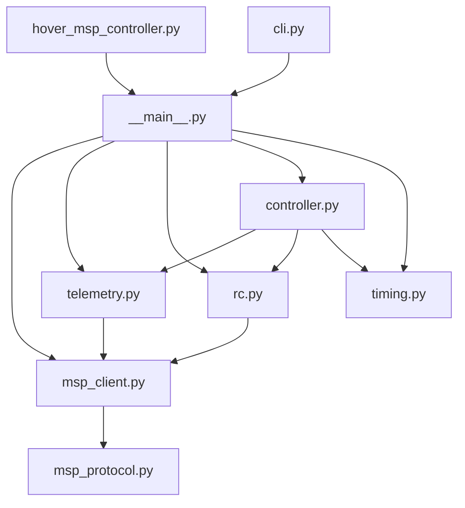
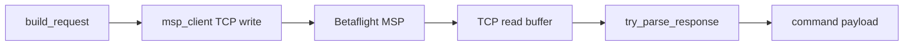
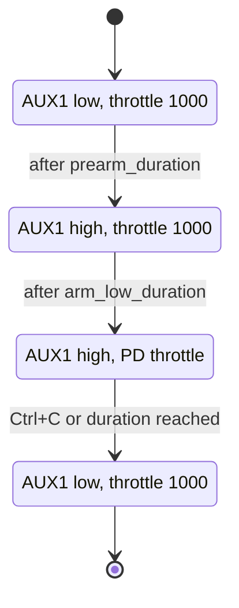

# MSP hover code design

The MSP hover controller is split into small modules so each concern is isolated.

## Component Diagram



## Module Responsibilities

| Module | Responsibility |
|---|---|
| `msp_protocol.py` | Build and parse MSP v1 byte frames |
| `msp_client.py` | TCP connection, reads, writes, request/response matching |
| `telemetry.py` | Decode `MSP_ALTITUDE` into meters and meters per second |
| `rc.py` | Build 16-channel RC payloads and send `MSP_SET_RAW_RC` |
| `controller.py` | Arm sequence, hover phases, throttle control, disarm |
| `timing.py` | Fixed-rate loop timing |
| `cli.py` | User options and runtime configuration |
| `__main__.py` | Wire dependencies and run the controller |

## SOLID Mapping

Single Responsibility:

- MSP framing does not know about sockets.
- TCP transport does not know about hover behavior.
- RC encoding does not know about altitude.
- The controller does not know about MSP bytes.

Open/Closed:

- A new telemetry source can replace `AltitudeTelemetry`.
- A new controller can replace `HoverController`.
- MSP v2 support can be added inside protocol/client code without changing RC channel encoding.

Liskov Substitution:

- Tests can substitute fake telemetry and fake RC senders that follow the same behavior expected by `HoverController`.

Interface Segregation:

- The controller only needs altitude samples and RC sending.
- It does not depend on low-level TCP operations.

Dependency Inversion:

- `__main__.py` builds concrete dependencies.
- `HoverController` receives dependencies instead of constructing them internally.

## MSP Frame Flow



## Controller State Flow



## Data Units

Betaflight returns `MSP_ALTITUDE` as:

```text
int32 altitude_cm
int16 vario_cm_s
```

The controller converts to:

```text
altitude_m = altitude_cm / 100
raw_vario_mps = vario_cm_s / 100
vertical_velocity_mps = delta_altitude_m / delta_time_s
```

The controller keeps the raw MSP vario as fallback for the first sample, then derives vertical velocity from altitude changes. This avoids depending on the raw vario sign convention for the damping term.

RC channels are sent as 16 little-endian `uint16` values.
