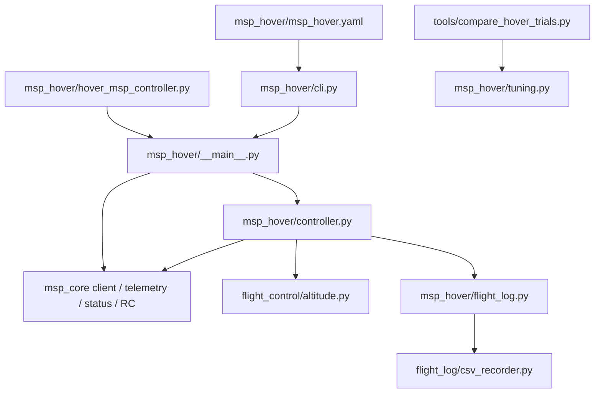
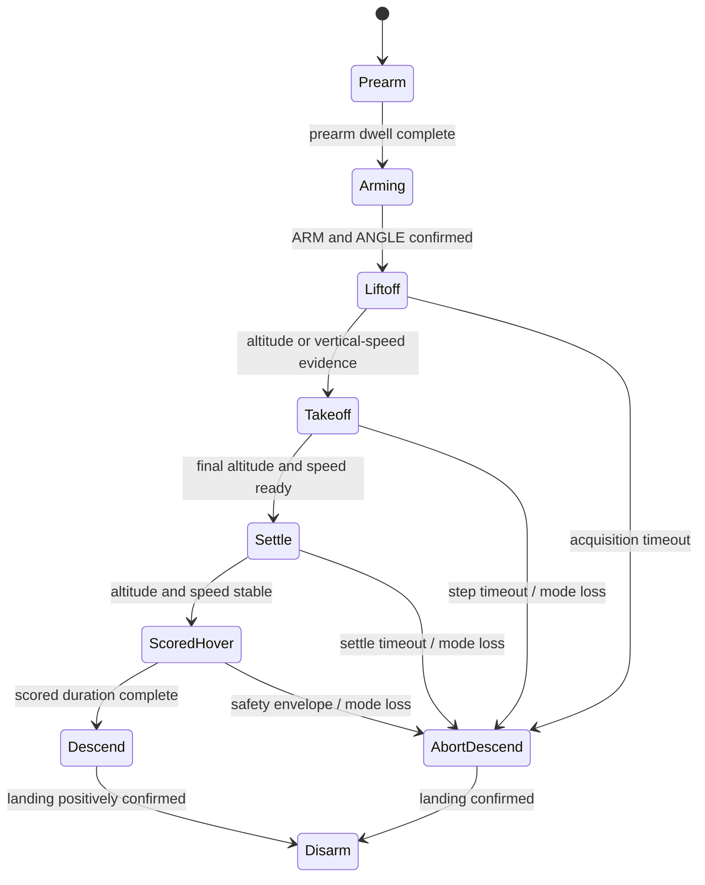

# MSP hover code design

The hover mission keeps transport, reusable control primitives, logging storage,
and flight policy behind separate interfaces. `msp_hover` contains policy; it
does not implement MSP framing or CSV storage.

## Components



| Module | Responsibility |
|---|---|
| `msp_core` | MSP framing, TCP transport, telemetry/status decoding, RC output, timing |
| `flight_control/altitude.py` | Reusable altitude PID, anti-windup, velocity estimate, throttle slew limit, altitude steps |
| `flight_log/csv_recorder.py` | Generic buffered CSV recorder with no mission dependency |
| `msp_hover/controller.py` | Hover state machine and safety policy |
| `msp_hover/flight_log.py` | Hover-specific metrics and summary generation |
| `msp_hover/tuning.py` | Compare repeated baseline and candidate trials |
| `msp_hover/cli.py` | Load and validate YAML, then apply CLI overrides |
| `msp_hover/msp_hover.yaml` | Default connection, control, mission, safety, and logging values |

The external CSV model can be reused by another implementation:

```python
from flight_log.csv_recorder import CsvRecorder

with CsvRecorder(path, ["elapsed_s", "state", "value"]) as recorder:
    recorder.write({"elapsed_s": 0.1, "state": "running", "value": 42})
```

`CsvRecorder` accepts any stable field list and mapping. It knows nothing about
MSP or hover cycles and periodically flushes buffered rows.

## State and safety model



The mission uses launch-relative altitude. Liftoff acquisition holds the target
at launch altitude while applying climb feed-forward, then confirms movement
from altitude or vertical speed. Only then does takeoff ramp the target continuously
at the configured climb rate and abort if measured
altitude falls too far behind. The scored-hover timer starts after settle. Descent ramps its
target at the configured rate; disarm happens only after both low height and
low vertical speed remain true for the landing dwell.

Unexpected disarm, loss of ANGLE, stale MSP responses, excessive scored-hover
error, and phase timeouts fail the mission. Failures occurring in flight use a
controlled abort descent when communication and arming state still permit it.
The `finally` path always sends a low-throttle disarm burst.

## Control data and units

`MSP_ALTITUDE` supplies signed altitude in centimetres and vario in centimetres
per second. `AltitudeTelemetry` converts both directly to metres and metres per
second. Raw vario is logged for diagnosis, but damping and safety gates use a
low-pass-filtered derivative of altitude because SITL vario can diverge from
observed position change. The PID is:

```text
error = target_altitude - altitude
desired = hover_throttle + kp*error + ki*integral - kd*vertical_velocity
sent = throttle_slew_limit(desired)
```

Integration is gated to small altitude error and vertical speed. Saturation-aware
anti-windup prevents integration when it would push farther into a throttle
limit. Logs retain both desired and sent throttle so slew limiting is visible.

## Configuration and tuning cycle

The entrypoint and ordinary two-level YAML file are colocated:

```text
scripts/msp_hover/hover_msp_controller.py
scripts/msp_hover/msp_hover.yaml
```

The small documented YAML schema is parsed without an external PyYAML
dependency. CLI values override common YAML fields for temporary experiments.

Run one bounded trial:

```bash
python3 scripts/msp_hover/hover_msp_controller.py
```

Each run writes a full-cycle CSV and JSON summary under `logging.directory`.
Metrics are separated into takeoff, steady scored hover, landing, and safety.
Only `scored_hover` samples contribute to hover RMSE, vertical-speed RMS,
saturation, and deadbanded oscillation rate. Metrics are accumulated online,
so mission duration does not grow memory usage.

Use at least three runs for both baseline and candidate, with the same simulator
initial condition and only one changed parameter. Compare their medians:

```bash
python3 scripts/tools/compare_hover_trials.py \
  --baseline logs/msp-hover/base{1,2,3}-summary.json \
  --candidate logs/msp-hover/candidate{1,2,3}-summary.json
```

The comparison rejects unsafe or incomplete trials. By default it keeps a
candidate only when median RMSE improves by at least 5% and max error,
vertical-speed RMS, saturation, and oscillation do not regress by more than
10%. Tune hover throttle first, then damping/proportional response, and add
integral only for persistent bias.
