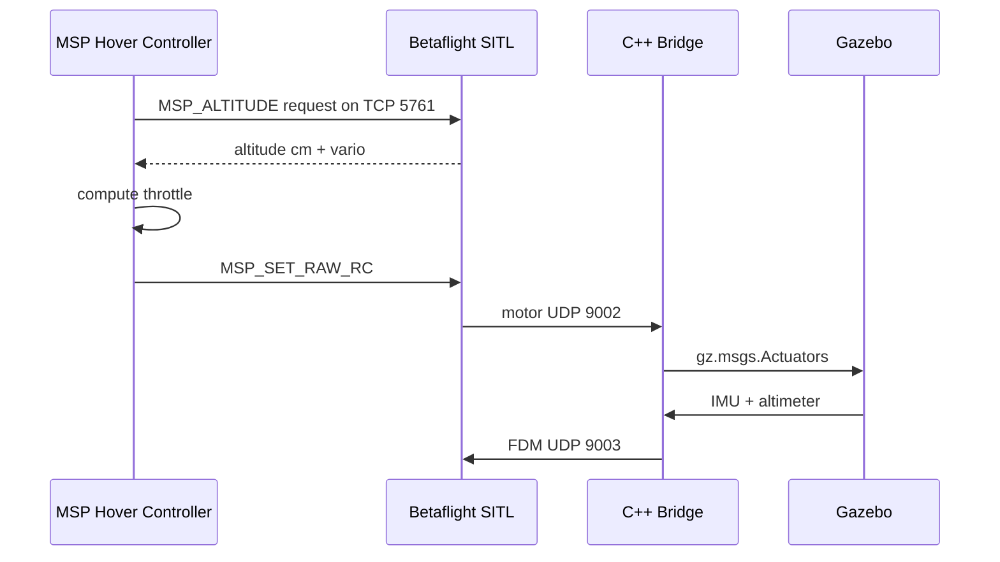

# MSP hover controller

The MSP hover controller is a Python RC controller for Betaflight SITL.

It replaces the old Gazebo-altimeter + UDP `9004` RC idea with a Betaflight MSP flow:

- Read altitude from Betaflight with `MSP_ALTITUDE`.
- Send RC channels to Betaflight with `MSP_SET_RAW_RC`.
- Use AUX1 high to arm.
- Use AUX2 high to enable ANGLE mode.
- Control throttle to hold a target altitude.

The C++ bridge still runs. It continues to send Gazebo sensor feedback to Betaflight and publish Betaflight motor output back to Gazebo.

## Runtime Flow



## Setup

Regenerate Betaflight EEPROM after changing the CLI profile:

```bash
scripts/run_betaflight_sitl.sh --config config/betaflight/sitl_modes.cli
```

The CLI profile enables MSP RC:

```text
feature -RX_UDP
feature RX_MSP
```

It also keeps the mode mapping:

```text
AUX1 high = ARM
AUX2 high = ANGLE
```

## Usage

Start Gazebo, Betaflight SITL, the bridge, and websockify with the VS Code task:

```text
Command Palette -> Tasks: Run Task -> Stack: run all
```

Then run the hover controller in a separate terminal:

```bash
scripts/hover_msp_controller.py --target-altitude 5
```

For the full direct Python workflow, including PID tuning and the Gazebo hover view, see:

```text
docs/usage/msp_hover_python.md
```

Run with gentler output:

```bash
scripts/hover_msp_controller.py --target-altitude 5 --kp 60 --kd 45 --max-throttle 1650
```

Run with integral correction to close steady-state altitude error:

```bash
scripts/hover_msp_controller.py --target-altitude 5 --hover-throttle 1750 --kp 120 --ki 15 --kd 60
```

Run for a fixed time:

```bash
scripts/hover_msp_controller.py --target-altitude 5 --duration 30
```

When `--duration` is set, the controller descends before disarming. Tune that phase with:

```bash
scripts/hover_msp_controller.py --target-altitude 5 --duration 30 --descent-duration 8 --landing-altitude 0.15
```

## Arm Sequence

The controller sends RC through `MSP_SET_RAW_RC`.

```text
3 seconds: AUX1 low, AUX2 high, throttle 1000
1 second:  AUX1 high, AUX2 high, throttle 1000
hover:     AUX1 high, AUX2 configurable, throttle from controller
exit:      AUX1 low, AUX2 configurable, throttle 1000
```

Channel layout:

| Channel | Meaning | Value |
|---:|---|---:|
| 1 | Roll | 1500 |
| 2 | Pitch | 1500 |
| 3 | Throttle | controlled |
| 4 | Yaw | 1500 |
| 5 | AUX1 ARM | 1000 or 2000 |
| 6 | AUX2 ANGLE | 2000 by default, 1000 with `--no-angle-mode` |

## Control Loop

The first implementation uses a simple PD throttle controller. The derivative term is computed from consecutive MSP altitude samples so the damping sign matches the altitude value used by the controller.

```text
error = target_altitude_m - altitude_m
vertical_velocity_mps = delta_altitude_m / delta_time_s
integral_error = clamp(integral_error + error * dt, -integral_limit, integral_limit)
throttle = hover_throttle + kp * error + ki * integral_error - kd * vertical_velocity_mps
```

The command is clamped:

```text
min_throttle <= throttle <= max_throttle
```

Defaults:

| Parameter | Default |
|---|---:|
| Target altitude | `5.0 m` |
| Rate | `50 Hz` |
| Hover throttle | `1600` |
| `kp` | `100` |
| `ki` | `0` |
| `kd` | `90` |
| Integral limit | `5 m*s` |
| Min throttle | `1100` |
| Max throttle | `2000` |
| Descent duration | `8 s` |
| Landing altitude | `0.15 m` |

## Troubleshooting

If the script cannot connect, confirm SITL is running and UART1 is listening:

```bash
ss -ltnp | grep 5761
```

If the script sends RC but Betaflight does not arm:

- Regenerate `eeprom.bin` from `config/betaflight/sitl_modes.cli`.
- Confirm `feature RX_MSP` is enabled.
- Confirm AUX1 maps to ARM.
- Confirm AUX2 maps to ANGLE.
- Keep throttle low during arming.

If altitude is stale or zero:

- Confirm the C++ bridge is running.
- Confirm bridge logs show `imu=true altimeter=true`.
- Confirm FDM packets are increasing.
