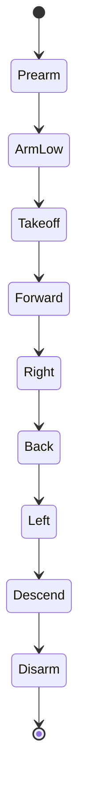

# MSP square mission

The MSP square mission controller flies a simple closed-loop square using:

- Gazebo pose feedback from `/model/X3/pose`.
- Betaflight altitude from `MSP_ALTITUDE`.
- Betaflight RC commands through `MSP_SET_RAW_RC`.

The world must load Gazebo's pose publisher system. The project world publishes dynamic model pose on:

```text
/world/quadcopter/dynamic_pose/info
```

The script selects the `X3` model from that `gz.msgs.Pose_V` stream.

## Run

Generate the MSP RC EEPROM once:

```bash
scripts/run/run_betaflight_sitl.sh --config config/betaflight/sitl_modes.cli
```

Run the full stack and square mission:

```bash
scripts/run_msp_hover_stack.sh --mission square
```

The stack runner writes each process to `logs/msp-hover-stack-.../`, and the active mission controller also prints state logs to the terminal. During square flight you should see lines such as `state: takeoff -> leg_forward`, `command: forward-position-pid`, and periodic altitude / position / RC command values.

By default, the square legs start only after altitude is within `--position-tolerance` of `--takeoff-altitude`. If the vehicle climbs but stalls below the `4 m` default, keep the altitude target at `4 m` but start lateral flight once a lower safe altitude is reached:

```bash
scripts/run_msp_hover_stack.sh --mission square -- --start-square-altitude 1.5
```

Useful smoke-test command:

```bash
scripts/run_msp_hover_stack.sh --headless --mission square -- --takeoff-altitude 0.1 --square-side 0.1 --max-horizontal-speed 0.2 --max-mission-duration 35 --position-tolerance 0.3 --landing-altitude 0.15
```

## Mission



Default behavior:

| Phase | Behavior |
|---|---|
| Takeoff | Climb to `4 m` |
| Forward | Fly `6 m` along initial body-forward |
| Right | Fly `6 m` along initial body-right |
| Back | Fly `6 m` back |
| Left | Fly `6 m` home |
| Descend | Reduce altitude target at `1 m/s` |
| Disarm | Disarm below `0.20 m` |

## Position control

The script does not use fixed roll and pitch for each side. It closes the loop on Gazebo pose:

```text
position_error = waypoint_xy - current_xy
measured_velocity = delta_position / delta_time
desired_velocity = kp_position * position_error - kd_position * measured_velocity
desired_velocity += ki_position * integrated_position_error
desired_velocity = clamp_norm(desired_velocity, max_horizontal_speed)
```

Default maximum commanded horizontal speed:

```text
1.0 m/s
```

The desired world velocity is converted into the initial body frame, then into RC stick offsets.

Default RC direction assumptions:

| Command | Default sign |
|---|---:|
| Pitch forward | `-1` |
| Roll right | `1` |

That means pitch-forward initially sends less than `1500`, and roll-right initially sends more than `1500`. These signs are configurable:

```bash
scripts/missions/msp_square_mission.py --pitch-forward-sign -1 --roll-right-sign 1
```

If a Betaflight setup uses opposite stick signs, invert the relevant flag.

## Main parameters

| Option | Default |
|---|---:|
| `--takeoff-altitude` | `4` |
| `--start-square-altitude` | `0` |
| `--square-side` | `6` |
| `--max-horizontal-speed` | `1` |
| `--descent-rate` | `1` |
| `--position-tolerance` | `0.5` |
| `--roll-min`, `--roll-max` | `1200`, `1800` |
| `--pitch-min`, `--pitch-max` | `1200`, `1800` |
| `--rc-us-per-mps` | `250` |
| `--kp-position`, `--ki-position`, `--kd-position` | `0.8`, `0.05`, `0.35` |
| `--position-integral-limit` | `3.0` |
| `--max-leg-duration` | `45` |
| `--max-mission-duration` | `240` |
| `--pose-topic` | `/world/quadcopter/dynamic_pose/info` |
| `--model-name` | `X3` |

## Safety

The script disarms in `finally`, so normal exit, timeout, and errors all send a low-throttle disarm burst.

The mission exits with an error if:

- Gazebo pose does not arrive.
- Gazebo pose stops updating.
- A square leg exceeds `--max-leg-duration`.
- The whole mission exceeds `--max-mission-duration`.

If the log stays in `takeoff` and roll / pitch remain `1500`, the lateral PID is not active yet. That means the altitude gate has not opened. Use a lower `--takeoff-altitude`, a larger `--position-tolerance`, or set `--start-square-altitude` to begin the square once the vehicle reaches a practical altitude.

If the drone reaches takeoff altitude but does not move laterally, increase RC authority:

```bash
scripts/run_msp_hover_stack.sh --mission square -- --rc-us-per-mps 300 --roll-min 1100 --roll-max 1900 --pitch-min 1100 --pitch-max 1900
```

The speed cap still limits the desired horizontal velocity to `--max-horizontal-speed`; the wider RC range only gives Betaflight more stick authority to achieve that speed.
