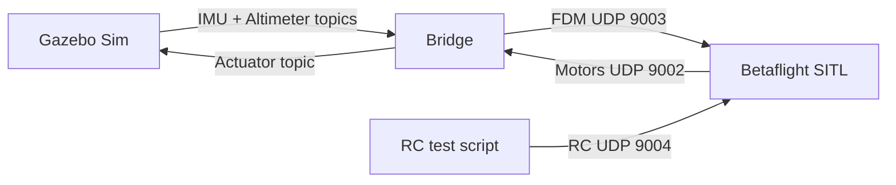
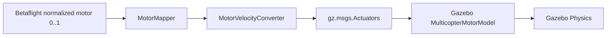
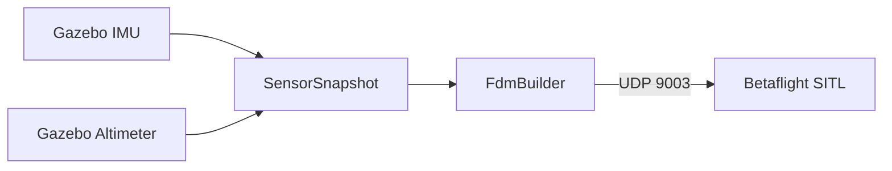

# Project summary presentation

## Slide 1: Project

`gz_betaflight_bridge` connects Betaflight SITL to Gazebo Sim Harmonic.

It lets Betaflight run the flight-control loop while Gazebo simulates the quadcopter model, sensors, motor dynamics, and physics.

## Slide 2: Problem

Betaflight SITL and Gazebo do not speak the same runtime interface directly.

Betaflight expects simulator feedback over UDP and sends normalized motor output over UDP. Gazebo expects `gz.msgs.Actuators` motor velocity commands and publishes sensor data on Gazebo Transport topics.

## Slide 3: Solution

The bridge is a standalone C++ process that translates between both systems:



## Slide 4: Runtime Components

- Gazebo world: `worlds/quadcopter.sdf`
- Local X3 model: `models/betaflight_x3`
- Betaflight SITL binary: `bin/betaflight_SITL.elf`
- Bridge executable: `build/debug/betaflight_gazebo_bridge`
- Bridge config: `config/bridge.yaml`
- RC helper: `scripts/send_rc_test.py`
- Stack launcher: `scripts/run_takeoff_stack.sh`

## Slide 5: Core Bridge Responsibilities

- Subscribe to Gazebo IMU and altimeter topics.
- Build Betaflight-compatible FDM packets.
- Send FDM to Betaflight on UDP `9003`.
- Receive Betaflight motor packets on UDP `9002`.
- Convert normalized motor commands to rotor velocity.
- Publish `gz.msgs.Actuators` to Gazebo.
- Publish zero motor velocity if motor packets time out.

## Slide 6: Motor Command Path



The bridge does not compute thrust. Gazebo's multicopter motor plugin converts rotor velocity into force and torque.

## Slide 7: Sensor Feedback Path



The current bridge uses IMU and altimeter data. Position and velocity fields in the FDM packet are currently filled from available altitude data.

## Slide 8: Configuration

Important defaults:

| Setting | Value |
|---|---|
| Motor UDP input | `9002` |
| FDM UDP output | `9003` |
| RC UDP input to SITL | `9004` |
| IMU topic | `/imu` |
| Altimeter topic | `/altimeter` |
| Actuator topic | `/X3/gazebo/command/motor_speed` |
| Max rotor velocity | `800 rad/s` |

## Slide 9: Current Verified Workflow

Generate EEPROM once:

```bash
scripts/run_betaflight_sitl.sh --config config/betaflight/sitl_modes.cli
```

Run the whole stack:

```bash
scripts/run_takeoff_stack.sh
```

Run headless:

```bash
scripts/run_takeoff_stack.sh --headless
```

## Slide 10: Important Debug Finding

Gazebo must load the physics system:

```xml
<plugin
  filename="gz-sim-physics-system"
  name="gz::sim::systems::Physics">
</plugin>
```

Without this plugin, motor commands can arrive but the vehicle will not move.

## Slide 11: Current Limitations

- Single quadcopter focus.
- Simplified altitude feedback.
- No battery sag model.
- No motor electrical or ESC response model.
- No GPS conversion.
- No wind, sensor delay, packet loss, or rotor failure simulation.
- RC takeoff helper is a smoke-test tool, not a flight mission controller.

## Slide 12: Next Improvements

- Battery model linked to motor velocity limits.
- ESC and motor response curves.
- Full pose and velocity feedback from Gazebo state.
- Configurable sensor noise, delay, and dropout.
- Motor-order verification tools.
- Launch profiles for hover, takeoff, and failsafe tests.
- Multi-vehicle support with namespaced topics and unique UDP ports.

