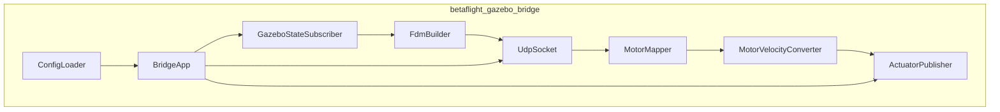
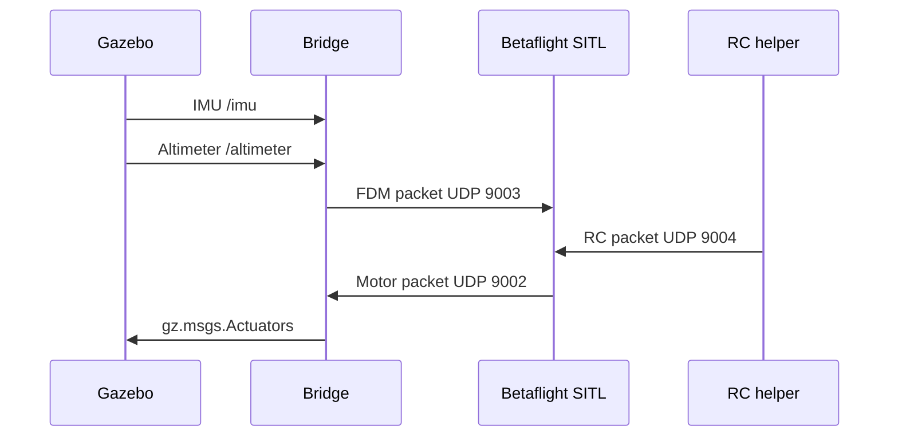

# Requirements, design, plan, and usage

## Purpose

This project provides a standalone bridge between Betaflight SITL and Gazebo Sim Harmonic.

Betaflight SITL runs the flight-controller logic. Gazebo Sim runs the vehicle model, motor model, sensors, and physics. The bridge translates data between them.

## Requirements

System requirements:

- Linux x86-64.
- Gazebo Sim Harmonic.
- CMake 3.23 or newer.
- Ninja.
- C++20 compiler.
- GDB for VS Code debugging.
- `yaml-cpp`.
- `spdlog`.
- Betaflight SITL executable at `bin/betaflight_SITL.elf`.

Install the common build dependencies on Ubuntu:

```bash
sudo apt update
sudo apt install build-essential cmake ninja-build gdb libyaml-cpp-dev libspdlog-dev
```

Gazebo Harmonic should be installed separately from Gazebo's official packages.

## Functional Requirements

The bridge must:

- Load YAML configuration from `config/bridge.yaml` or `--config`.
- Subscribe to Gazebo IMU and altimeter topics.
- Send Betaflight FDM packets to UDP `9003`.
- Listen for Betaflight motor packets on UDP `9002`.
- Convert normalized Betaflight motor commands to Gazebo rotor velocity.
- Publish `gz.msgs.Actuators` to `/X3/gazebo/command/motor_speed`.
- Stop motors on timeout.
- Log lifecycle, first-packet events, status counters, and malformed packet counts.
- Provide `--version` for release identification.

## Non-Functional Requirements

- UDP receive operations must not block the main bridge loop.
- Configuration errors must fail early with clear messages.
- Runtime logs must make it obvious whether IMU, altimeter, FDM, and motor traffic are active.
- Motor mapping must be configurable because Betaflight and Gazebo motor order may differ.
- Generated files, logs, build trees, EEPROM, and runtime artifacts must stay out of git.

## Design



Key design choice: the bridge is protocol glue, not a physics model.

Gazebo's `MulticopterMotorModel` owns thrust, drag, reaction torque, and rotor dynamics. The bridge publishes rotor velocity commands only.

## Data Flow



## Build

Configure and build:

```bash
cmake --preset debug
cmake --build --preset debug
```

Run tests:

```bash
ctest --test-dir build/debug --output-on-failure
```

Print executable version:

```bash
./build/debug/betaflight_gazebo_bridge --version
```

## Configure Betaflight EEPROM

Generate `eeprom.bin` once:

```bash
scripts/run_betaflight_sitl.sh --config config/betaflight/sitl_modes.cli
```

This maps:

```text
AUX1 high = ARM
AUX2 high = ANGLE
```

## Usage

Recommended full-stack launch:

```bash
scripts/run_takeoff_stack.sh
```

Headless launch:

```bash
scripts/run_takeoff_stack.sh --headless
```

Gentler takeoff:

```bash
scripts/run_takeoff_stack.sh --ramp-end 1600 --hold-duration 20
```

Start the stack without RC:

```bash
scripts/run_takeoff_stack.sh --no-rc
```

Manual launch order:

```bash
scripts/run_quadcopter_world.sh
scripts/run_betaflight_sitl.sh
scripts/run_bridge.sh
scripts/send_rc_test.py --takeoff-sequence
```

The dependency order matters:

1. Gazebo first, so sensor and actuator topics exist.
2. SITL second, so UDP ports are open.
3. Bridge third, so it can connect Gazebo and SITL.
4. RC last, so Betaflight can arm after FDM traffic exists.

## Validation

Check bridge logs for:

```text
imu=true
altimeter=true
fdm_packets increasing
motor_packets increasing
malformed_motor_packets=0
```

Watch actuator commands:

```bash
gz topic -e -t /X3/gazebo/command/motor_speed
```

Verify Gazebo-only lift:

```bash
gz topic -t /X3/gazebo/command/motor_speed --msgtype gz.msgs.Actuators -p 'velocity:[700, 700, 700, 700]'
```

Stop motors:

```bash
gz topic -t /X3/gazebo/command/motor_speed --msgtype gz.msgs.Actuators -p 'velocity:[0, 0, 0, 0]'
```

## Implementation Plan

Near-term plan:

1. Keep the standalone bridge stable.
2. Improve FDM position and velocity fields from Gazebo model state.
3. Add motor-order verification tooling.
4. Add battery-aware rotor velocity scaling.
5. Add sensor noise and delay configuration.
6. Add automated integration smoke tests for Gazebo topic flow.

Longer-term plan:

1. Support multiple vehicles through namespaces and port sets.
2. Add realistic ESC and motor curves.
3. Add wind and disturbance models.
4. Add GPS and barometer realism.
5. Add failure injection for motors, sensors, and network traffic.

