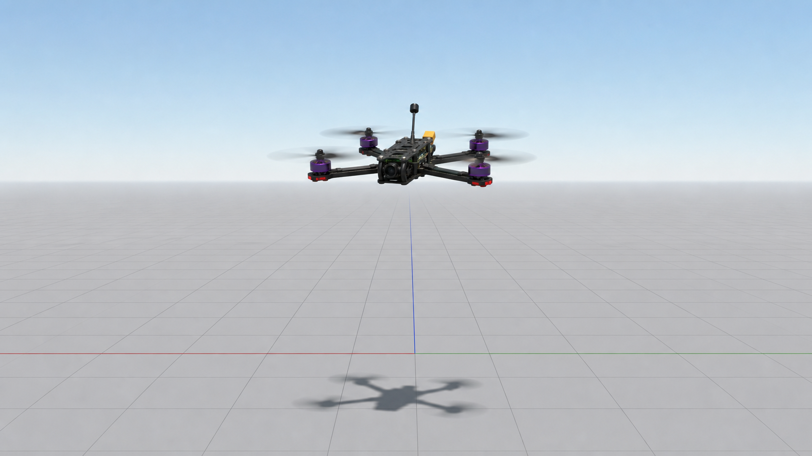

# MSP hover Python usage

This guide runs the simulation stack separately from the hover controller. Use VS Code to start Gazebo, Betaflight SITL, the bridge, and websockify, then run `scripts/hover_msp_controller.py` directly so PID tuning stays explicit.



The image above is a documentation illustration of the expected Gazebo view: the X-style quadcopter should lift off, remain level, and hover above the ground plane.

## One-time setup

- set eeprom settings
  - aux1
  - aux2

Generate the Betaflight SITL EEPROM profile for MSP RC:

```bash
scripts/run_betaflight_sitl.sh --config config/betaflight/sitl_modes.cli
```

This profile enables `RX_MSP`, disables `RX_UDP`, maps AUX1 high to ARM, and maps AUX2 high to ANGLE mode.

---

## Start the stack in VS Code

Open the workspace in VS Code, then run:

```text
Command Palette -> Tasks: Run Task -> Stack: run all
```

The task starts four split terminals in the same terminal panel group:

| Task | Command | Purpose |
|---|---|---|
| `Stack: gazebo` | `scripts/run_quadcopter_world.sh -r` | Starts the Gazebo quadcopter world |
| `Stack: sitl` | `scripts/run_betaflight_sitl.sh` | Starts Betaflight SITL |
| `Stack: bridge` | `scripts/run_bridge.sh ${workspaceFolder}/config/bridge.yaml` | Builds if needed, then connects Gazebo sensors and Betaflight motor outputs |
| `Stack: websockify` | `uv run websockify 127.0.0.1:6761 127.0.0.1:5761` | Exposes Betaflight MSP TCP for WebSocket clients |

Wait until the bridge terminal shows live IMU and altimeter data before starting hover. If the Python script cannot connect, confirm Betaflight MSP is listening:

```bash
ss -ltnp | grep 5761
```

## Run hover directly

Open a separate terminal in the repo root and run:

```bash
scripts/hover_msp_controller.py \
  --target-altitude 5 \
  --duration 45 \
  --hover-throttle 1750 \
  --kp 120 \
  --ki 15 \
  --kd 60 \
  --integral-limit 5 \
  --min-throttle 1200 \
  --max-throttle 2000 \
  --descent-duration 8 \
  --landing-altitude 0.15
```

`--duration 45` runs the hover mission for 45 seconds. After that, the controller descends for `--descent-duration 8` seconds toward `--landing-altitude 0.15`, then sends a disarm burst.

## PID parameters

The throttle command is:

```text
error = target_altitude_m - altitude_m
integral_error = clamp(integral_error + error * dt, -integral_limit, integral_limit)
throttle = hover_throttle + kp * error + ki * integral_error - kd * vertical_velocity_mps
```

| Parameter | Meaning |
|---|---|
| `--hover-throttle` | Base throttle around the expected hover point |
| `--kp` | Adds throttle in proportion to current altitude error |
| `--ki` | Adds throttle for persistent altitude error, useful when the drone settles below target |
| `--kd` | Reduces throttle while climbing fast and adds damping |
| `--integral-limit` | Clamps accumulated error to avoid integral windup |
| `--min-throttle` | Lower throttle clamp during hover and descent |
| `--max-throttle` | Upper throttle clamp |

If the drone stops below `5 m`, increase `--ki` slowly:

```bash
--ki 20
--ki 25
```

If it overshoots or oscillates, reduce `--ki` or increase `--kd`:

```bash
--ki 8
--kd 80
```

If throttle stays near `2000` and altitude still does not increase, the limiting factor is probably the Gazebo motor model or Betaflight motor output, not the Python PID gains.

## Script behavior

`scripts/hover_msp_controller.py` talks directly to Betaflight MSP on `127.0.0.1:5761`.

It performs these phases:

| Phase | RC output |
|---|---|
| `prearm` | throttle `1000`, AUX1 low, AUX2 high by default |
| `arm-low` | throttle `1000`, AUX1 high |
| `hover` | AUX1 high, throttle controlled by PID |
| `descend` | AUX1 high, target altitude ramps down |
| `disarm` | throttle `1000`, AUX1 low |

The controller does not start Gazebo, SITL, or the bridge. Start those with the VS Code task or with separate manual terminals before running the Python script.
